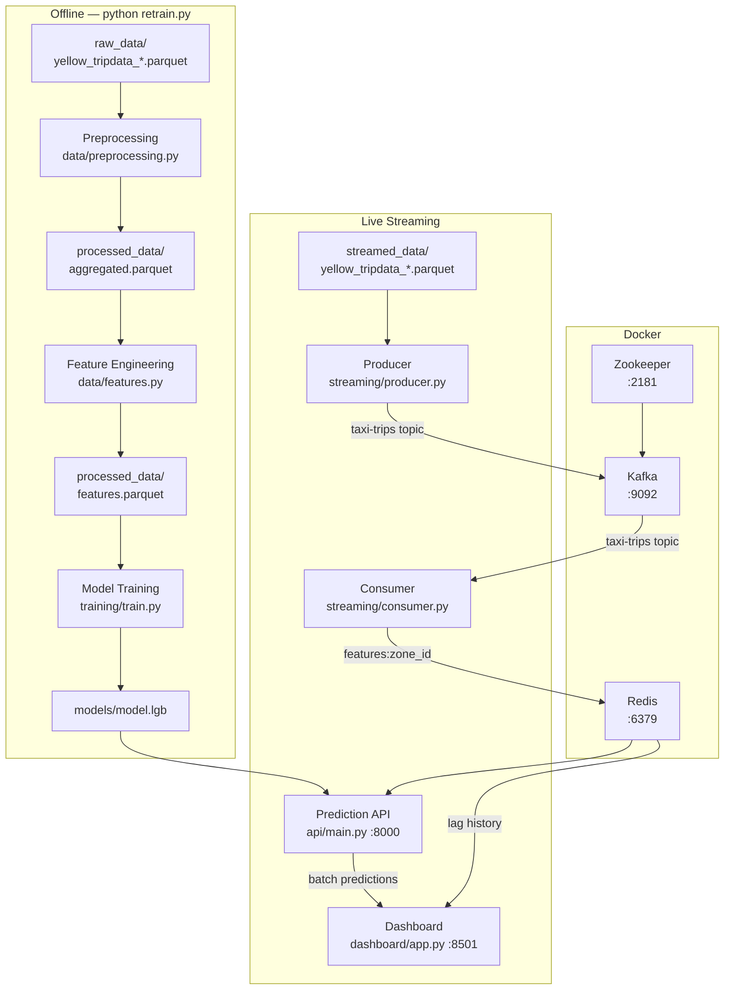

# NYC Taxi Demand Forecasting

Real-time taxi demand prediction system using NYC Yellow Taxi data. Predicts trip count per zone for the next hour, running locally on a single machine.

**Stack:** LightGBM · FastAPI · Apache Kafka · Redis · Streamlit · Python 3.10+

---

## Architecture

### How it works

The system has two phases:

**Training (offline)** — run once before the live pipeline. Raw historical trip records are aggregated into hourly counts, transformed into lag and rolling-mean features, and used to train a LightGBM regression model saved to `models/model.lgb`.

**Live streaming** — four concurrent processes simulate and serve real-time demand. A Kafka producer replays recent trip data as a live event stream. A consumer reads those events, maintains a rolling 24-hour feature window per zone, and writes the latest features to Redis. A FastAPI service reads from Redis and uses the trained model to return next-hour trip count predictions. A Streamlit dashboard polls the API every 10 seconds and visualizes predictions and actuals across all zones.

### Diagram



---

## Prerequisites

- Python 3.10+
- [Docker Desktop](https://www.docker.com/products/docker-desktop/) (for Kafka, Zookeeper, Redis)

---

## Data Download

All files come from the [TLC Trip Record Data](https://www.nyc.gov/site/tlc/about/tlc-trip-record-data.page) page. Under **Yellow Taxi Trip Records**, download the monthly Parquet files and place them as described below.

### `raw_data/` — historical data for model training

Place at least 1 year of monthly Parquet files here. More history improves model quality.

```
raw_data/
  yellow_tripdata_2025-01.parquet
  yellow_tripdata_2025-02.parquet
  ...
```

### `streamed_data/` — data for live simulation

Place the most recent month(s) here. The Kafka producer replays these files as a simulated event stream.

```
streamed_data/
  yellow_tripdata_2026-01.parquet
```

### `reference_data/` — zone lookup

Download the **Taxi Zone Lookup Table** (CSV) from the same page and place it at `reference_data/taxi_zone_lookup.csv`.

---

## Setup

### 1. Create and activate a virtual environment

```bash
python -m venv .venv
```

**Windows:**
```bash
.venv\Scripts\activate
```

**macOS/Linux:**
```bash
source .venv/bin/activate
```

### 2. Install dependencies

```bash
pip install -r requirements.txt
```

---

## Data Preparation

Run this once before starting the streaming pipeline, and any time you add new data:

```bash
python retrain.py
```

This runs preprocessing → feature engineering → model training in sequence and saves the model to `models/model.lgb`.

---

## Running the System

### Launch script (all services at once)

The launch scripts start Docker infrastructure and open each service in its own terminal window.

**Windows:**
```bash
start.bat
```

**macOS:**
```bash
chmod +x start.sh
./start.sh
```

> The macOS script uses `osascript` to open new Terminal windows — no third-party tools required.

### Manual start (individual terminals)

#### Start infrastructure (Kafka + Zookeeper + Redis)

```bash
docker compose up -d
```

Services exposed:
- Zookeeper: `localhost:2181`
- Kafka broker: `localhost:9092`
- Redis: `localhost:6379`

#### Start the streaming pipeline

```bash
# Terminal 1 — consumer (populates Redis with live features)
python streaming/consumer.py

# Terminal 2 — producer (replays historical data into Kafka)
python streaming/producer.py
```

#### Start the prediction API

```bash
# Terminal 3
uvicorn api.main:app --port 8000
```

#### Start the dashboard

```bash
# Terminal 4
streamlit run dashboard/app.py
```

Opens at `http://localhost:8501`. The map auto-refreshes every 10 seconds.
